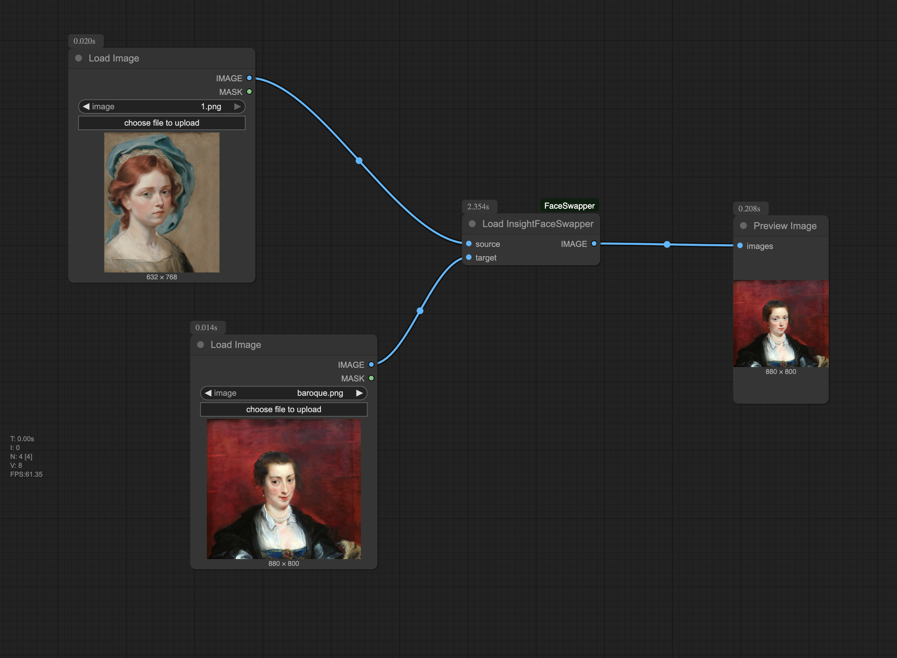

# InsightFaceSwapper-Comfy
🛠️ 换脸节点安装与使用说明

概述

本节点基于 InsightFace 的 inswapper_128.onnx 模型，支持在 ComfyUI 中快速实现脸部替换。
适合一图驱动换脸应用，效果稳定、易于集成。

📥 安装步骤
	
1. 将节点文件夹下载后放入你的 ComfyUI custom_nodes 目录中：
```
ComfyUI/custom_nodes/InsightFaceSwapper-Comfy
```

2. 在 ComfyUI/models/ 目录下新建 insightface 子文件夹：
```
ComfyUI/models/insightface
```

3. 从公众号提供的网盘链接下载模型文件，放入该目录中。

4. 重启 ComfyUI。启动时系统会自动加载新节点与模型。

⸻

🔧 使用方法

1.	从左侧面板添加 Load Image 节点，调用作为“源脸”；

2.	再添加一个 Load Image 节点，作为“目标图/视频帧”输入；

3.	添加并连接Load InsightFaceSwapper节点：
	- source_image 接源脸；
	- target_image 接目标图；

4.	运行节点 ➜ 得到替换后的合成效果图。


⸻
